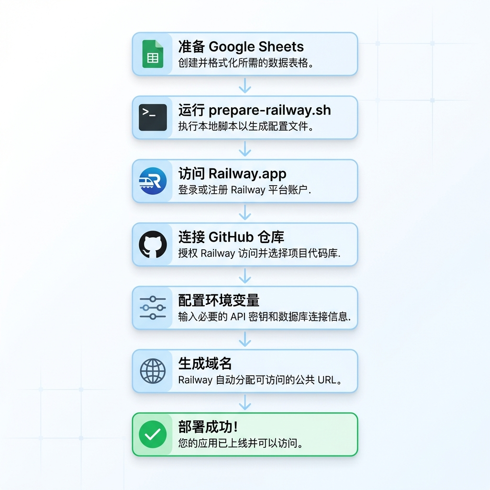

# Railway 部署总结

## ✅ 已完成的准备工作

### 1. 配置文件
- ✅ `railway.json` - Railway 部署配置
- ✅ `.railwayignore` - 防止敏感文件上传
- ✅ `prepare-railway.sh` - 自动化环境变量准备脚本

### 2. 文档
- ✅ `QUICKSTART.md` - 3分钟快速开始指南
- ✅ `DEPLOYMENT.md` - 完整部署指南（含故障排除）
- ✅ `DEPLOYMENT-CHECKLIST.md` - 逐步检查清单
- ✅ `README.md` - 更新了部署指引

### 3. Git 仓库
- ✅ 所有文件已提交到 Git
- ✅ 代码已推送到 GitHub
- ✅ `.gitignore` 已更新，保护敏感文件

## 🚀 现在你可以开始部署了！

### 方法一：网页部署（推荐）

1. **准备环境变量**
   ```bash
   cd /Users/kenanfr/Documents/GitHub/reservation
   ./prepare-railway.sh
   ```
   
   这会生成 `railway-env.txt` 文件。

2. **访问 Railway**
   
   👉 https://railway.app/
   
   - 使用 GitHub 登录
   - 创建新项目
   - 选择 `kenanfr/reservation` 仓库

3. **配置环境变量**
   
   在 Railway Settings → Variables 中添加：
   - 打开 `railway-env.txt`
   - 复制 `GOOGLE_SHEET_ID` 的值
   - 复制 `GOOGLE_CREDENTIALS_JSON` 的值

4. **生成域名并访问**
   
   Settings → Networking → Generate Domain

### 方法二：CLI 部署

```bash
# 安装 CLI
npm install -g @railway/cli

# 登录
railway login

# 初始化
railway init

# 准备环境变量
./prepare-railway.sh

# 设置变量（打开编辑器）
railway variables

# 部署
railway up

# 查看日志
railway logs
```

## 📊 部署流程图



## 🔍 验证清单

部署后请检查：

### Railway 控制台
- [ ] 构建状态：Success ✅
- [ ] 部署状态：Active ✅
- [ ] 日志显示：
  ```
  ✅ Google Sheets API 已连接
  🙏 牧师教练预约系统已启动
  ```

### 应用功能
- [ ] 访问 Railway URL 正常加载
- [ ] 可以选择日期
- [ ] 可以查看时段
- [ ] 可以成功预约
- [ ] 数据同步到 Google Sheets

### Google Sheets
- [ ] 服务账号有编辑权限
- [ ] Sheet 包含标题行
- [ ] 预约数据正确写入

## 💡 重要提示

### 环境变量格式
`GOOGLE_CREDENTIALS_JSON` 必须是**单行 JSON**，例如：
```json
{"type":"service_account","project_id":"your-project",...}
```

### 常见错误
1. **JSON 格式错误** → 重新运行 `./prepare-railway.sh`
2. **Sheet 权限错误** → 检查服务账号邮箱是否添加到 Sheet
3. **部署失败** → 查看 Railway 日志

## 📞 获取帮助

- 📖 [快速开始](./QUICKSTART.md)
- 📖 [完整指南](./DEPLOYMENT.md)
- ✅ [检查清单](./DEPLOYMENT-CHECKLIST.md)

## 🎯 下一步

1. **立即部署**
   - 运行 `./prepare-railway.sh`
   - 访问 Railway.app
   - 按照指南操作

2. **测试应用**
   - 访问生成的 URL
   - 进行一次测试预约
   - 检查 Google Sheets

3. **分享给用户**
   - 将 Railway URL 分享给需要预约的人
   - 监控预约数据

## 💰 费用说明

Railway 免费额度：
- ✅ 每月 $5 免费额度
- ✅ 500 小时执行时间
- ✅ 100GB 出站流量

对于这个预约系统，**免费额度完全够用**！

## 🔐 安全检查

- ✅ `credentials.json` 不在 Git 中
- ✅ `.env` 不在 Git 中
- ✅ 环境变量在 Railway 中安全存储
- ✅ `.railwayignore` 防止敏感文件上传

---

## 🎉 准备完成！

你的项目已经完全准备好在 Railway 上部署了。

**现在就开始吧：**

```bash
./prepare-railway.sh
```

然后访问 👉 https://railway.app/

祝部署顺利！🚀
